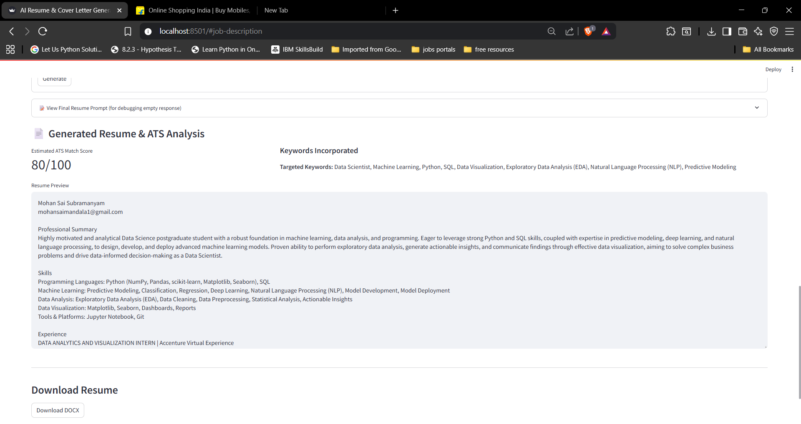
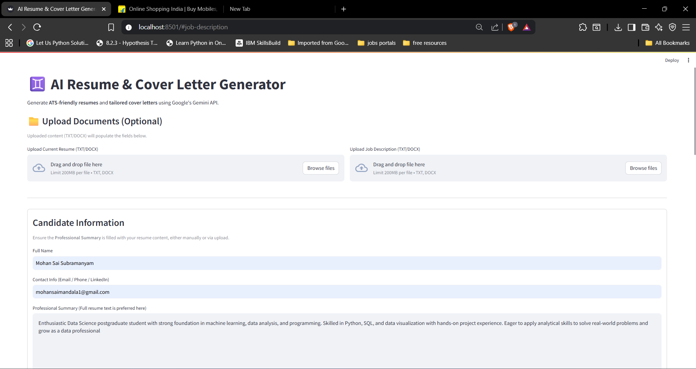
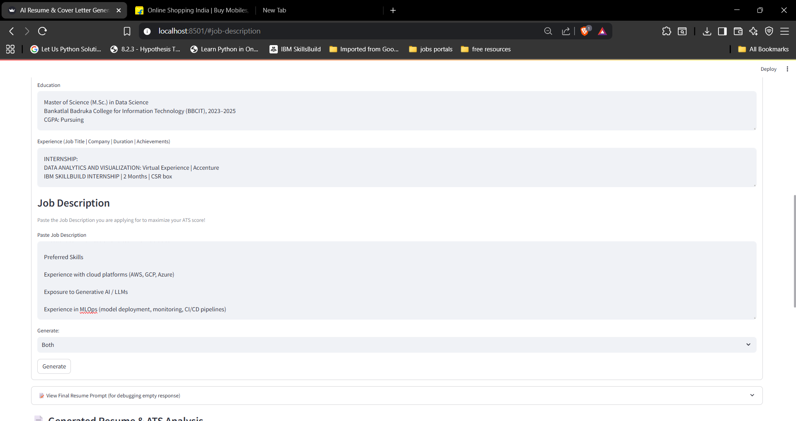

# AI Resume & Cover Letter Generator 🚀

An intelligent web application built with **Streamlit** and **Google Gemini API** that helps job seekers create ATS-optimized resumes and cover letters tailored to any job description.

## ✨ Features

* 📄 **AI-Powered Resume Enhancement** – Upload your resume and let AI suggest improvements.
* 📝 **Cover Letter Generation** – Auto-generate personalized cover letters based on job descriptions.
* 🔍 **ATS Optimization & Scoring** – Get a keyword match score against the job description.
* 📊 **Skills & Gaps Analysis** – Identify missing skills and strengths.
* ⚡ **One-Click Export** – Download AI-enhanced resume & cover letter.

## 🛠️ Tech Stack

* **Frontend**: [Streamlit](https://streamlit.io/)
* **AI Model**: [Google Gemini API](https://ai.google.dev/)
* **Backend**: Python (FastAPI optional for API integration)
* **Version Control**: Git + GitHub

## 📂 Project Structure

```
Ai-Resume-Cover-Letter-Generator/
├── src/                 # Core logic & AI pipeline
│   ├── config.py        # Configuration & API key management
│   ├── utils.py         # Gemini API integration
│   ├── prompts.py       # Prompt templates
│   ├── parser.py        # Document parsing utilities
│   └── export.py        # Export to DOCX/PDF
├── result/              # Sample output screenshots
├── app.py               # Main Streamlit application
├── requirements.txt     # Python dependencies
├── .env.example         # Environment variables template
├── LICENSE              # MIT License
└── README.md            # Project documentation
```

## ⚡ Installation & Usage

### Prerequisites
- Python 3.8 or higher
- Google Gemini API key (get it from [Google AI Studio](https://ai.google.dev/))

### Setup Instructions

1. **Clone this repository:**

```bash
git clone https://github.com/3101mohan/Ai-Resume-Cover-Letter-Generator.git
cd Ai-Resume-Cover-Letter-Generator
```

2. **Create and activate a virtual environment:**

```bash
python -m venv .venv
.venv\Scripts\activate   # Windows
source .venv/bin/activate  # Linux/Mac
```

3. **Install dependencies:**

```bash
pip install -r requirements.txt
```

4. **Configure your API key:**

Create a `.env` file in the project root and add your Gemini API key:

```env
GEMINI_API_KEY=your_api_key_here
```

**Note:** You can copy `.env.example` to `.env` and update it with your actual API key.

5. **Run the app:**

```bash
streamlit run app.py
```

6. **Open your browser at [http://localhost:8501](http://localhost:8501)** 🎉

## 📸 Preview

Check out sample outputs in the [result folder](./result):




## 🌟 Future Enhancements

* Multi-language resume generation
* PDF resume parser for automatic import
* Integration with LinkedIn profiles
* Cloud deployment (Streamlit Cloud / Hugging Face Spaces)

## 🤝 Contributing

Contributions are welcome! Feel free to fork this repo, open issues, or submit PRs.

## 📜 License

This project is licensed under the **MIT License**.
